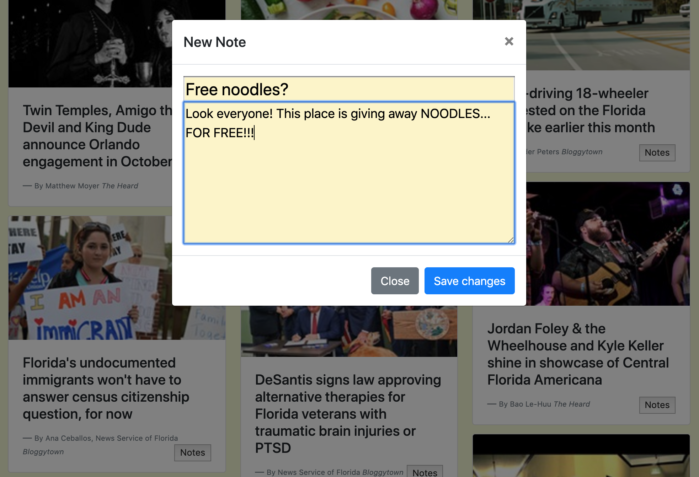

# Mongo Scraper

### Overview

For this project, I will create a web app that lets users view and leave comments on the latest news. But I'm not going to actually write any articles; instead, I'll flex my Mongoose and Cheerio muscles to scrape news from another site.

### Here's How It Works

  1. Whenever a user visits the site, the app should scrape stories from a news outlet of my choice (Orlando Weekly) and display them for the user. Each scraped article should be saved to the application database. The app should scrape and display the following information for each article:

     * Headline - the title of the article

     * Image - a short thumbnail of the article

     * URL - the url to the original article

     * Byline - OW author of the publication

     * Category - Section of the OW the article comes from

  2. Users should also be able to leave comments on the articles displayed and revisit them later. The comments should be saved to the database as well and associated with their articles. Users should also be able to delete comments left on articles. All stored comments should be visible to every user.

### Helpful Links

* [MongoDB Documentation](https://docs.mongodb.com/manual/)
* [Mongoose Documentation](http://mongoosejs.com/docs/api.html)
* [Cheerio Documentation](https://github.com/cheeriojs/cheerio)

### Technologies Used

* HTML
* CSS
* JavaScript
* Node.js
* MongoDB
* Express
* Handlebars
* Mongoose
* Cheerio
* Axios

### Links

[Mongo-Scraper Heroku](https://mongo-scraper-sickels.herokuapp.com/)

